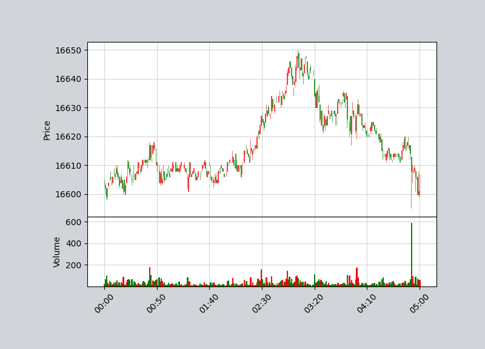

# shioaji_sample

# 查詢使用版本

``` python
import shioaji as sj

print(sj.__version__)
```

# 登入
``` python
import os
import shioaji as sj
from dotenv import load_dotenv

api = sj.Shioaji(simulation=True) # 虛擬環境

api.login(
    api_key=os.getenv('API_KEY'),
    secret_key=os.getenv('SECRET_KEY'),
    contracts_cb=lambda security_type: print(f"{repr(security_type)} fetch done.")
)

# login 參數
# api_key (str): API金鑰
# secret_key (str): 密鑰
# fetch_contract (bool): 是否從快取中讀取商品檔或從伺服器下載商品檔 (預設值: True)
# contracts_timeout (int): 獲取商品檔 timeout (預設值: 0 ms)
# contracts_cb (typing.Callable): 獲取商品檔 callback (預設值: None)
# subscribe_trade (bool): 是否訂閱委託/成交回報 (預設值: True)
# receive_window (int): 登入動作有效執行時間 (預設值: 30,000 毫秒)

```
# 訂閱委託/成交回報

``` python
# 訂閱委託/成交回報
api.subscribe_trade(account)
# 訂閱委託/成交回報
api.unsubscribe_trade(account)
```

# 登出

``` python
api.logout()
```

# 股票

``` python
api.Contracts.Stocks.TSE.TSE2890
api.Contracts.Stocks.TSE['2890']
api.Contracts.Stocks['2890']
```

# 期貨

``` python
api.Contracts.Futures.TXF.TXF202110
api.Contracts.Futures.TXF['TXFJ1']
api.Contracts.Futures['TXFJ1']
```

# 期貨

``` python
api.Contracts.Options.TXO.TXO202110017500C
api.Contracts.Options.TXO['TXO17500J1']
api.Contracts.Options['TXO17500J1']
```

# 測試

``` python
import mplfinance as mpf
import pandas as pd

# 抓取2023-05-27 台指近一 資料
kbars = api.kbars(
        contract=api.Contracts.Futures.TXF.TXFR1, 
        start="2023-05-27", 
        end="2023-05-27"
    )
df = pd.DataFrame({**kbars})
df.ts = pd.to_datetime(df.ts)
df.index = df.ts
df = df.drop("Amount", axis = 1)    
df = df.drop("ts", axis = 1)

# 重新排列資料順序
df.reindex(columns=['Open', 'High', 'Low', 'Close','Volume'])

# 設定K棒顏色 up為陽線, down為陰線
marketcolors = mpf.make_marketcolors(
        up='r',
        down='g', 
        edge='inherit', 
        wick='inherit', 
        volume='inherit'
    )

# 設定圖表style
style = mpf.make_mpf_style(
        marketcolors=marketcolors,
        figcolor='(0.82, 0.83 ,0.85)', 
        gridcolor='(0.82, 0.83 ,0.85)'
    )
    
mpf.plot(
        df, 
        style=style, 
        type='candle', 
        volume=True
    )
```



# 參考資料